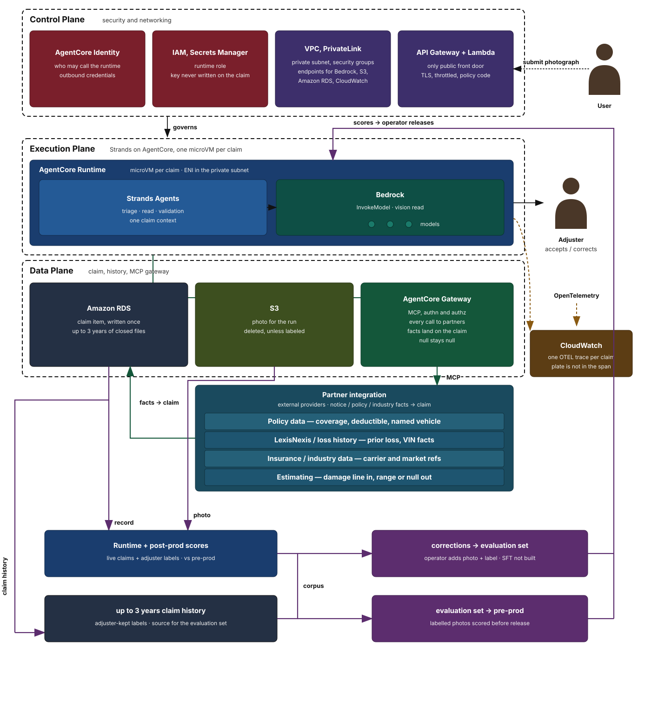

# Overview

This project takes one photograph of a damaged vehicle and returns a typed estimate: make, model, colour, a damage summary, and a rough repair-cost range. An adjuster reviews that result and decides whether to accept or correct it, and the software does not authorize payment. The running system is a Strands harness on Amazon Bedrock AgentCore Runtime, a fixed path of prompt, tools, and stop, deployed as a code zip and invoked with AWS Signature Version 4. Each session runs in its own microVM, partner tools are a fixed allowlist, and logs and traces are vended to CloudWatch. The requirements are in [docs/requirements.md](docs/requirements.md) and the architecture is in [docs/architecture.md](docs/architecture.md).



## Prerequisites

- **Python 3.12.x** and [uv](https://docs.astral.sh/uv/)
- **Node.js** (for `npx aws-cdk`)
- **AWS CLI** configured with an access key and secret key (or another credential source) for the target account and Region (default `us-west-2`)
- IAM principal able to:
  - **Amazon Bedrock** — `InvokeModel` / converse on the inference profile in use (default `us.anthropic.claude-sonnet-4-6`)
  - **Bedrock AgentCore** — create and invoke AgentCore Runtime (deploy + `cli.py`)
  - **AgentCore Gateway** — when partner MCP via Gateway is wired (not required for the current stub tools)
  - **CloudFormation / CDK / IAM / CloudWatch Logs / X-Ray** — for `deploy.py` (stack, roles, Transaction Search → Omni)
- **AWS Marketplace** — Claude access is per model. Run `[scripts/enable_claude.py](scripts/enable_claude.py)` once. Pass the **foundation model** id (`anthropic.claude-sonnet-4-6`); the harness calls the **US inference profile** (`us.anthropic.claude-sonnet-4-6`). A Marketplace agreement of AVAILABLE does not mean Converse works: this account is denied `claude-sonnet-5` / `claude-opus-5-5` until AWS sales allowlists them.

```sh
uv run scripts/enable_claude.py \
  --company "YourOrg" \
  --website "https://example.com" \
  --use-case "Vehicle damage photo estimating prototype" \
  --model anthropic.claude-sonnet-4-6
```

## Deploy on AWS Bedrock AgentCore

Strands harness (triage → read → validate) on Bedrock AgentCore Runtime. Model: `us.anthropic.claude-sonnet-4-6`.

```sh
uv sync --all-groups
npx aws-cdk bootstrap          # once per account and Region, from this directory
uv run deploy.py               # Omni/Transaction Search + stack (idempotent)
uv run cli.py img/veh1.jpeg
uv run pytest
npx aws-cdk destroy
```

`deploy.py` enables CloudWatch Transaction Search (idempotent), deploys the AgentCore code zip with tracing, and sends application/usage logs to `/aws/vendedlogs/bedrock-agentcore/ClaimsFactoryHarness`. Local harness: `uv run python -m claims.agent`. After redeploy, GenAI Observability on that runtime shows the harness spans.

**See logs / Omni:** CloudWatch (same Region) → GenAI Observability or Omni → AgentCore; Log groups → `ClaimsFactoryHarness`.

## Local FastAPI (optional)

```sh
uv sync --all-groups
export ANTHROPIC_API_KEY=your-key
uv run python -m claims.web    # http://127.0.0.1:8080
```

