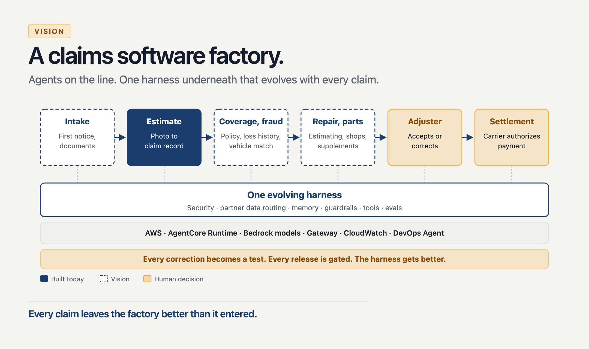

# Claims Factory Overview

This agentic project takes one photograph of a damaged vehicle and returns a typed estimate: make, model, colour, a damage summary, and a rough repair-cost range. An adjuster reviews that result and decides whether to accept or correct it, and the software does not authorize payment. The running system is a Strands harness on Amazon Bedrock AgentCore Runtime, a fixed path of prompt, tools, and stop, deployed as a code zip and invoked with AWS Signature Version 4. The models are the Claude Sonnet family, and the model id can be swapped. Each session runs in its own microVM, partner tools are a fixed allowlist, and logs and traces are vended to CloudWatch.

## Vision



## Documentation

- [Requirements](docs/requirements.md): what the customer asked for and how this answers it
- [Architecture](docs/architecture.md): how it works: design, security, evaluation, and trace reading
- [Evals](evals/README.md): running the evaluations

## Setup

- **Python 3.12.x** and [uv](https://docs.astral.sh/uv/)
- **Node.js**, for `npx aws-cdk`
- **AWS CLI** configured for the target account and Region (default `us-west-2`). Admin access is simplest for a non-production account; otherwise the principal needs Bedrock invoke on the inference profile, AgentCore Runtime create and invoke, and CloudFormation, CDK, IAM, CloudWatch Logs and X-Ray for `deploy.py`.

Claude access is granted per model in AWS Marketplace. Run this once; the harness calls the US inference profile `us.anthropic.claude-sonnet-4-6`:

```sh
uv run scripts/enable_claude.py \
  --company "YourOrg" \
  --website "https://example.com" \
  --use-case "Vehicle damage photo estimating prototype" \
  --model anthropic.claude-sonnet-4-6
```

An agreement marked AVAILABLE does not always mean the model works; AWS can still deny the account.

## Run locally

The harness runs in your own process and still calls Amazon Bedrock with your AWS credentials, through the same `claims/agent.py` that AgentCore runs. There is no AgentCore Runtime, no isolation between claims, and no CloudWatch trace.

```sh
uv sync --all-groups
uv run pytest
uv run python -m claims.localhost    # http://127.0.0.1:8080
```

Open the page, upload a photo, and type the policy code `local` (or your `POLICY_CODE_ADMIN`). It is the same page, size limit, and checks as the deployed one, and the result appears in the claim record box. The same server also answers `curl http://127.0.0.1:8080/ping`.

`uv run python -m claims.agent` serves only the API (`/invocations`, `/ping`) on :8080. It prints nothing and runs until you stop it; a claim is a POST to `/invocations` with `image_b64` and `media_type`.

To preview the page with no AWS and no model call, run `uv run python scripts/preview_page.py` (http://127.0.0.1:8081, policy code `preview`).

## Run on AWS

The same code now runs in Bedrock AgentCore Runtime, under a different security and isolation model: each session gets its own microVM, the runtime uses an IAM role limited to the one model profile, callers sign requests with AWS Signature Version 4, and logs and traces go to CloudWatch. `deploy.py` also publishes a public upload page on API Gateway (stack output `PublicUrl`) for one photo of 3 MB or less; only the code in `POLICY_CODE_ADMIN` reaches the runtime. Set it in the deploy shell or in the gitignored `.env`; `deploy.py` prints an `ERROR` line if it is missing.

```sh
npx aws-cdk bootstrap                        # once per account and Region
export POLICY_CODE_ADMIN='<10 characters or fewer>'
uv run deploy.py                             # idempotent: enables CloudWatch tracing, then deploys
uv run cli.py dataset/img/veh1.jpeg          # call the deployed runtime; add --json for raw JSON
uv run cli.py --otel-logs                    # newest claim's record and trace summary
uv run cli.py --claim-id <id>                # one claim; the page shows each claim's id
uv run cli.py --otel-logs --full             # the same plus every span and log record
npx aws-cdk destroy                          # remove the stack
```

`--otel-logs` and `--claim-id` read CloudWatch only and call no model; the newest records can take a minute to arrive. The output and its sensitivity are described in [Architecture](docs/architecture.md#reading-a-claims-trace). In CloudWatch (same Region), GenAI Observability and the `ClaimsFactoryHarness` log group show the runtime's spans and logs.

## Evals

The evals score Claude's written answers; they do not retrain Claude. One end-to-end run covers pre-prod, runtime, and post-prod and ends with a decision table for the operator and the adjuster:

```sh
uv run python evals/e2e.py --live                  # calls Bedrock; omit --live to call no model
uv run python evals/e2e.py --live --limit 10       # score only 10 photographs
uv run python evals/e2e.py --live --skip-preprod   # reuse .runtime/reports/preprod.json
```

Output goes to `.runtime/reports/e2e.md`. A result from `--live` on 100 photographs, plus the sample claim `veh2.jpg` (the saved pre-prod answers were reused):

| Phase | Metric | Result | n | Signal |
| --- | --- | ---: | ---: | --- |
| Pre-prod | damage_location | 0.94 | 100 | ok |
| Pre-prod | damage_severity | 0.29 | 100 | below the 0.80 floor |
| Pre-prod | safe_pricing | 1.00 | 100 | ok |
| Runtime | status, flagged | ok, no | 1 | ok |
| Runtime | estimate range, confidence | 3,500 to 7,500 USD, 0.62 | 1 | ok |
| Post-prod | damage_location, damage_severity vs pre-prod | 0.00, 0.00 | 1 | regressed (one simulated label, indicative only) |
| Post-prod | safe_pricing vs pre-prod | 1.00 | 1 | ok |

The run's next action is "fix harness": damage_severity is far below the floor. The post-prod rows use a fixed simulated adjuster label, so only their direction means anything.

Each phase also runs on its own:

```sh
uv run python evals/phases/preprod.py --live       # score every photograph; --refresh after a prompt, tool, or model change
CLAIMS_EVAL_LOG=1 uv run python -m claims.agent    # log each claim, without the photo, to .runtime/outcomes.jsonl
uv run python evals/phases/runtime.py              # flag unread, unpriced, low-confidence, or wide-range claims
uv run python evals/phases/postprod_report.py      # compare with adjuster labels in .runtime/labels.jsonl
uv run python dataset/fetch_history.py             # re-download the evaluation photographs
```

Options, inputs, and outputs of each phase are in [evals/README.md](evals/README.md); the design is in [Architecture](docs/architecture.md#evaluation). The photographs come from the MIT-licensed Hugging Face dataset [DrBimmer/comprehensive-car-damage](https://huggingface.co/datasets/DrBimmer/comprehensive-car-damage).

## Costs

Rough guesses at US list prices, not a quote; check current AWS pricing before relying on them. **Partner data integration (policy, loss history, estimating) is not included**: the partner tools are stubs today, and a real provider charges its own fees on top.

| Item                                            | 100,000 live claims | 100,000 images, one pre-prod eval run        |
| ----------------------------------------------- | ------------------- | -------------------------------------------- |
| Claude Sonnet 4.6 on Bedrock, the claim answers | about $3,000        | about $3,000                                 |
| Claude judge call per photo, evals only         | none                | about $600                                   |
| AgentCore Runtime compute                       | about $100          | none (eval runs the harness on your machine) |
| API Gateway and Lambda                          | under $20           | none                                         |
| CloudWatch logs and traces                      | under $50           | none                                         |
| **Total**                                       | **about $3,200**    | **about $3,600**                             |

Measured claims used 3,700 to 5,900 input tokens and about 650 output tokens, which is $0.02 to $0.03 each, or $2,200 to $2,800 per 100,000. The table uses $3,000 to leave room for longer answers and retries. At this volume, request quotas matter more than cost: the public page is throttled to 1 request a second, and an evaluation run is limited by your Bedrock quota, so it takes hours rather than minutes.

The stack costs close to nothing when unused, apart from a little CloudWatch log storage.

## License

[MIT](LICENSE)
