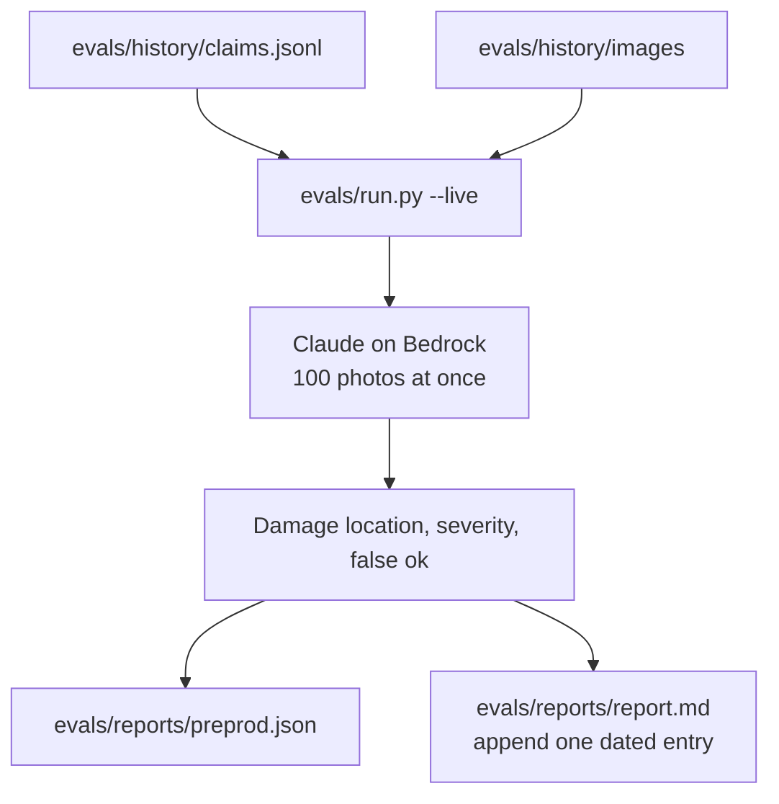
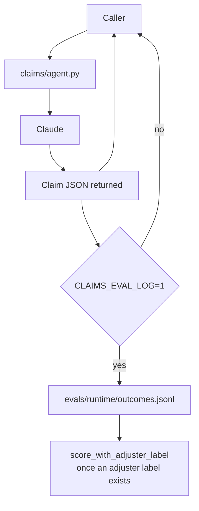
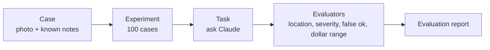
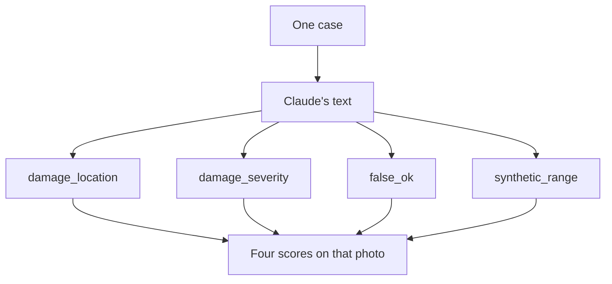

# Eval architecture

This page describes the evaluation workflows that exist in this repository. It is a living note. Update it after a few local runs, or when the scoring code changes, so the metrics at the bottom stay tied to the code. Each local run already appends a timestamped score block to `evals/reports/report.md`. Copy the new numbers here when you revise this page.

The latest local run is 2026-10-06 01:58. Damage location was 0.97, severity was 0.31, false ok was 1.00, and the invented dollar range was 0.22.

## Pre-prod

`uv run python evals/run.py --live` is the local batch. It loads the 100 photographs and notes in `evals/history`, sends every photo to Claude at once, scores the written answer, writes `evals/reports/preprod.json`, and appends one dated block to `evals/reports/report.md`. It does not retrain Claude.

The damage labels on those notes come from the Hugging Face set named in `evals/README.md`. Make, model, colour, and the dollar amounts do not.

## Runtime

A claim served by `claims/agent.py` records its JSON only when `CLAIMS_EVAL_LOG=1`. The photo is left out. The line is appended to `evals/runtime/outcomes.jsonl`. Nothing is scored at that moment, because there is no adjuster label yet. `score_with_adjuster_label` in `evals/score.py` is the later step, once a person supplies the kept fields.

## The four questions

These are the evaluation questions in `docs/requirements.md`, answered from the code and data as of the run above.

1. **Working.** We can measure whether Claude named the damage in the right place, and whether it called breakage versus crushed correctly. We cannot measure make, model, or colour. Those fields are empty on these photos.

2. **Failure.** We can measure a false ok: Claude priced a photo the notes said should stay unpriced. We cannot measure a wrong make. The “bad price range” score uses dollars we invented, so it does not show what this carrier would lose.

3. **Customer inputs.** We do not have them. There is no three-year claim history, no adjuster-kept amount, and no subject-matter expert on these rows. The photos are a public set.

4. **Repair cost.** We cannot say an estimate is good enough. That decision needs the dollar amount the adjuster actually kept. We do not have that number, so a wrong estimate is not being caught or saved for later training.

## Appendix A. Strands evals primer

Strands evals is the library that runs the exam. This repository uses four of its pieces: a case, an experiment, a task, and evaluators. A case is one photo plus the notes we already know. The experiment is the list of one hundred cases. The task is the function that shows one photo to Claude and returns the text. Each evaluator reads that text and the notes, then returns a score between 0 and 1, a pass or fail, and a short reason. The experiment collects those scores into one report.

One photo is scored four times, once by each evaluator. The dollar-range evaluator is included so the number is on the report, and the report marks it as synthetic. The other three are the quality scores.

The task is `assess_claim` in `evals/run.py`, marked with `@eval_task`. The evaluators are the classes in `evals/evaluators.py`. They do not call Claude again. They compare the text already returned with the notes on the case. The report is what `evals/reports/preprod.json` stores, and the dated summary in `evals/reports/report.md` is written from those scores.
