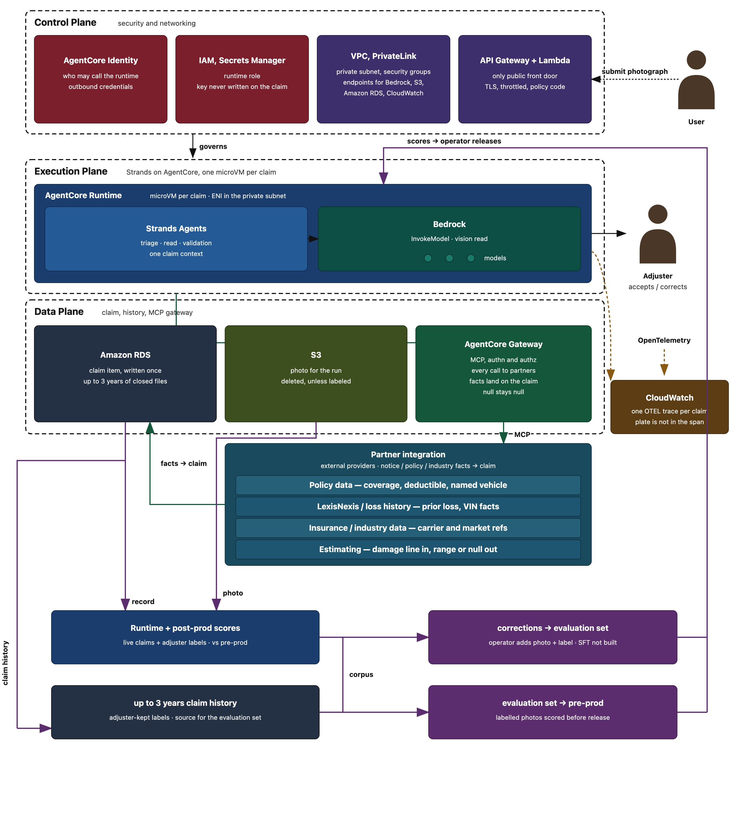
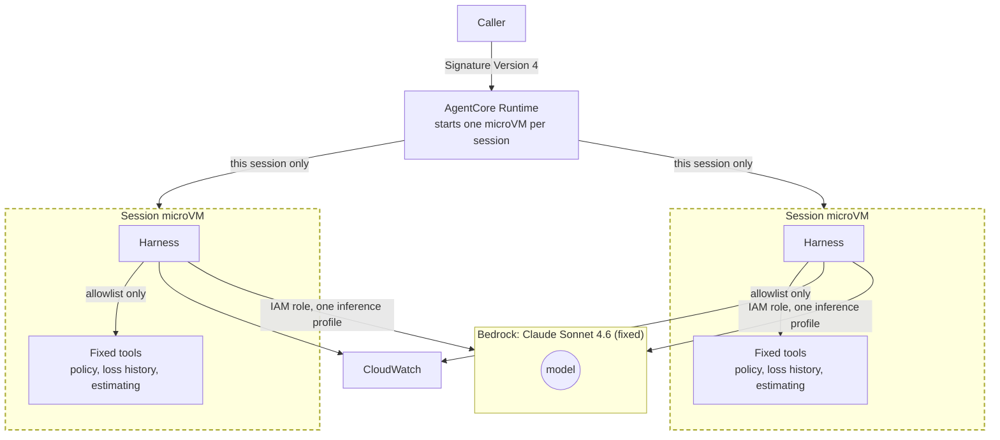
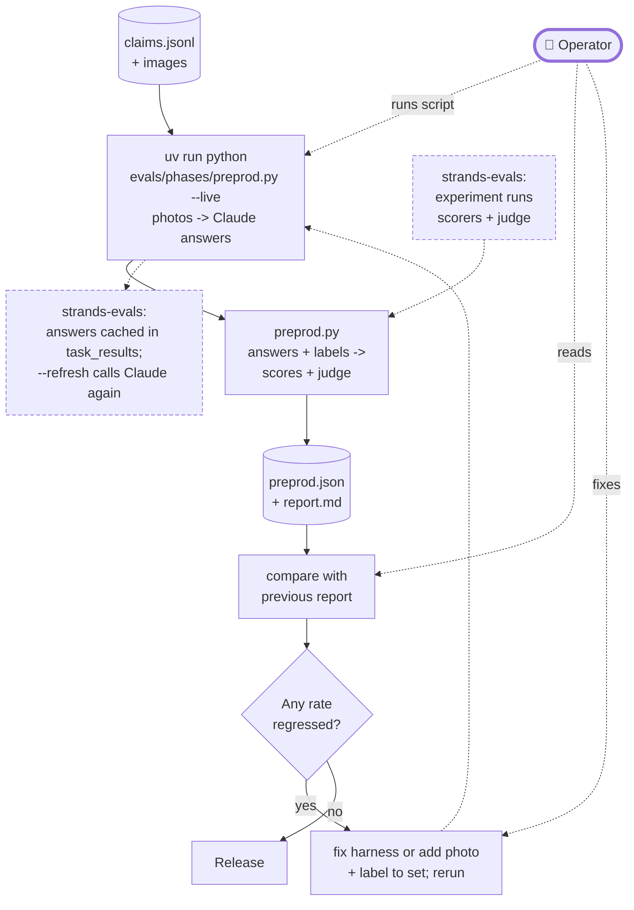
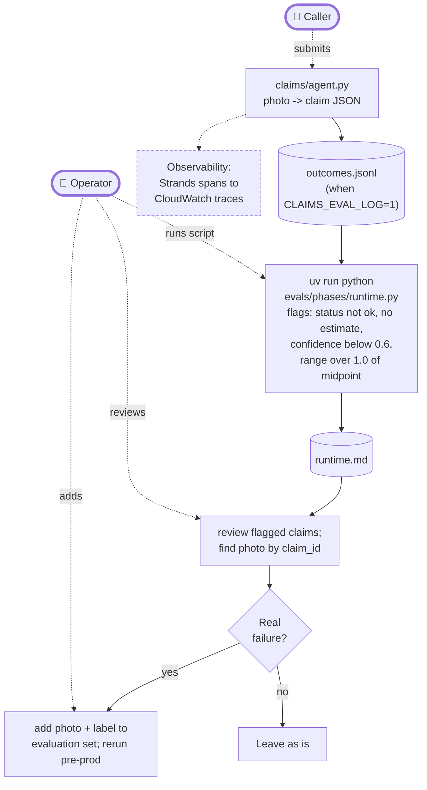
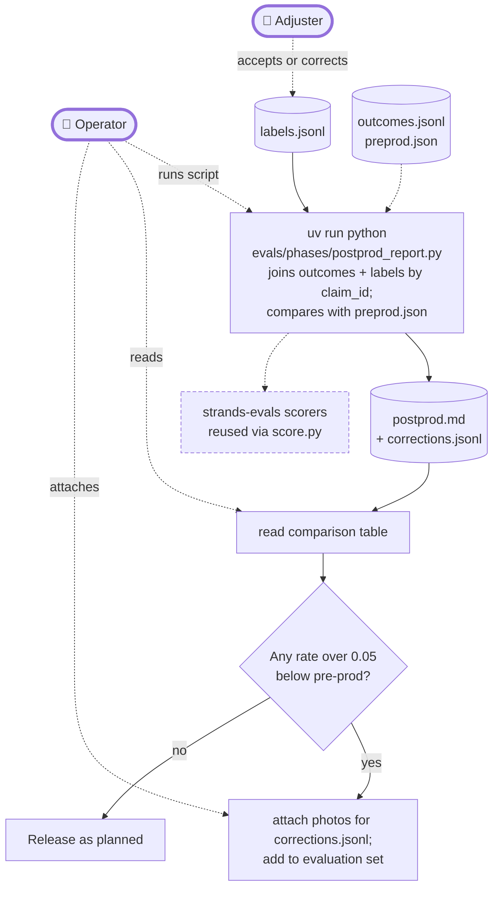

# Claims factory

## Business problem

Today most auto physical-damage claims still lean on manual triage and field or desk appraisal: slow handoffs, uneven estimates, and leakage when severity is understated or parts are missed. Industry averages put FNOL-to-vehicle-return near three weeks (J.D. Power: about 22–23 days recently), with appraisal alone often adding several days and tens to low hundreds of dollars per inspection. A photograph is a thin signal: occlusion, lighting, prior damage, and multi-vehicle frames make a reliable repair range hard to extract from photos alone. The desk still needs third-party facts the image cannot supply (policy, loss history, parts and labor guides), but those systems are fragmented and rarely wired into one typed claim.

## What this does

[The requirements](requirements.md): One photograph comes in; a typed claim record comes out. 

An agentic process turns one photograph of a damaged vehicle into a structured estimate the adjuster can review. When the photo is not a vehicle or cannot be read, the harness returns an empty claim and does not invent an estimate.

**Input.** One photograph of a damaged vehicle, by file upload or by URL. JPEG, PNG, and WebP are accepted. A private URL, any other media type, or a file past the size limit is refused before a model is called.

**Output.** One JSON object. Make, model, and colour may each be null when the photograph does not support them. The damage summary is one description, of the form "left rear bumper dent with scratching," together with the parts and a coarse severity. The estimated repair cost is a rough range: a low and a high in whole dollars, a currency, the assumptions the range rests on, and a confidence. Status is `ok` only when both the summary and the range are present. `not_a_vehicle` and `unreadable` are complete answers and carry a null estimate. A plate that could be read is stored on the claim and removed from logs.

## Architecture

The solution is a lite 'factory' of agents running in a custom, secure harness, running on AWS optimized Agent infrastructure and Bedrock for Model inference and fine tuning. A harness is the loop around  agent(s) with evals, guardrails, memory, prompts, tools, and a stop condition. A factory runs that harness the same way on every claim, optimizing the loop for the quality of the estimate. Quality is one loop: update the harness from past claims history before production, score accuracy on realtime claims, and collect live labels for scheduled retrain.

The submitter sends one photograph of the damaged vehicle: the public page takes an upload with a policy code, and the command-line client can also send a URL. The photograph enters through API Gateway and a small Lambda into one AgentCore Runtime, where Strands runs triage, read, and validation against Bedrock and fetches partner facts over MCP through AgentCore Gateway. Control Plane admits the request; Execution Plane turns it into a typed estimate: identity, damage summary, and a rough low/high when status is ok. Data Plane holds the claim and reaches partners for facts the photograph cannot supply. The claim lands in Amazon RDS, the photo is removed from S3 after the run. 

The adjuster reviews that record outside the planes, accepts or corrects it, and the kept pair joins claim history. When the harness returns an empty claim, the estimate stays null — nothing invented for the desk.

The architecture holds three planes: **Control Plane**, **Execution Plane**, and **Data Plane**. Outside those bands: the adjuster (human), observability (OpenTelemetry out to CloudWatch), and a partner integration layer reached only through the MCP gateway.

**Control Plane** governs who may call and where traffic may go. Callers authenticate before a claim starts; credentials for the run stay off the claim. The photograph hits the public front door first — a wrong policy code, wrong type, or a body over 3 MB never reaches the agent, and a private URL is refused before it is fetched. The runtime has no public address; model, storage, and telemetry stay on private paths. Plate values are stripped before any log or span.

**Execution Plane** runs one claim to a typed estimate. One AgentCore Runtime microVM wraps Strands and the vision model: triage, read, then validation against partner facts. When the photo is not a vehicle or cannot be read, triage writes `not_a_vehicle` or `unreadable` with a null estimate. The typed record leaves to the adjuster outside the planes, who accepts or corrects; that pair joins claim history for evals.

**Data Plane** holds the claim record and reaches partners for facts the photograph cannot supply. Claim items and closed history persist; the photograph is brief, then deleted unless copied onto a labeled pair. MCP through AgentCore Gateway fetches provider facts with authn and authz on every call; a null from a provider stays null. Kept labels feed eval scores and training pairs; a newer model ships only after it passes the evaluation set (labelled photographs in `dataset/history`, scored on every release candidate).

### Assumptions

1. Policy, coverage, and deductible are not in the photograph; the vehicle named on the notice is the compare key for mismatch.
2. Repair-price truth is the estimate the adjuster kept (and shop outcomes when present), not the model alone; the agent output is a visual low/high range.
3. Up to three years of closed claim history are available for offline evals and SFT pairs.
4. Hybrid, on-prem, and partner sources are reached via MCP through AgentCore Gateway, with authn and authz on every call.
5. The adjuster still accepts or corrects every estimate; desk authority limits may be unknown to the factory.
6. Photo bytes are deleted after the run unless copied onto a labeled pair for the eval or training set.

## Security and reliability

Callers authenticate with AWS Signature Version 4 (SigV4) on each request, so the harness does not depend on or keep long-lived tokens in the repository. AgentCore Runtime executes the harness inside a microVM, which isolates each session from other sessions and from the host, and the deployed artifact is a code zip (avoiding a container dependency) that an operator has to run and patch. The runtime Identity and Access Management (IAM) role is scoped to a single Bedrock inference profile, the one named in `deploy.py` (currently `us.anthropic.claude-sonnet-4-6`), so the process cannot call an arbitrary model. SigV4 authenticates the caller. AgentCore Runtime then places that session in its own microVM. The dotted box is that isolation boundary, and inside it the harness may call only the named partner tools.

The public upload page is the one unauthenticated entry point. API Gateway, throttled to one request per second with a burst of two, invokes a small Lambda that serves the form and accepts one photo of 3 MB or less (checked by size and image header) with a policy code of up to 10 characters; only a constant-time match with `POLICY_CODE_ADMIN` lets it call the runtime, through a role that can invoke that one runtime. Every failure returns the same message, results render as text under a strict content security policy, and neither the code nor the photo is logged or stored. The runtime mints a claim id and tags the claim's span with it; the page shows the id with the claim record, and `cli.py --claim-id` reads that claim's trace from CloudWatch.

The harness does not store photographs. When a caller passes an image URL, the public-address check in `claims/claim.py` refuses addresses that are not public, which keeps the runtime from fetching private or internal hosts. Adjuster review remains outside this path: the software returns a typed estimate for a person to accept or correct, and it does not authorize payment.

Reliability follows from a serverless runtime architecture that scales on demand, and runs a single fixed sequence — prompt, then registered tools, then stop — instead of open tool routing that could wander.  A partner tool that returns null leaves that null on the claim rather than filling in a guessed fact. The harness exports OpenTelemetry spans to the runtime collector and CloudWatch shows them on the AgentCore session.

## Evaluation

The factory prices vehicle damage from one photograph, so the question is whether that price, or the decision to withhold one, would survive an adjuster's review. The reference is what the adjuster kept on the same claim: make, model, colour, damage summary, and a low/high repair range, or an empty (null) range when no price could be given. Quality is measured against that decision, not model confidence: offline before release, from traces and logs at runtime, and against adjuster labels after review.

Three decisions, each with a cost:

- **Fixed model; behaviour changes only through a gated release.** Claude is used as supplied (nothing here trains or fine-tunes it), so behaviour changes only when the prompt, tools, model id, or thresholds change, and each such change is meant to pass the offline regression run on the evaluation set before release. Nothing learns inside a live request; each run writes `.runtime/reports/preprod.json` and appends a dated block to `.runtime/reports/report.md`, which with git history makes releases and rollbacks traceable (the pass/fail decision itself is manual).
- **Deterministic scorers decide; the LLM judge advises.** Code scores location, severity, withheld-versus-priced, and range containment. The judge checks only whether the prose is supported by the photograph; it is reported, not gated, and shares the harness's model.
- **Safe pricing is a first-class metric.** Safe pricing is the share of claims not priced when the photo should stay unpriced; a wrongly priced claim puts an invented number into payment, costlier than a wide range or a missed make.

**Implemented versus required.** The repository implements the pre-prod harness over 100 public photographs, runtime trace and outcome logging, and a no-model scorer against an adjuster label. Not implemented: automated promotion, alerting, drift detection, and scoring of make, model, colour, and repair cost. These need carrier data ([the Eval FAQ](#eval-faq)); thresholds here are proposals. `evals/e2e.py --live` runs all three stages once and prints one decision table.

### Pre-prod

Pre-prod is the only stage that can show a regression before a changed prompt, tool, or model id reaches a claim, because the expected answers are known. The operator (the engineer running the evaluation on the carrier's behalf) uses it to see whether any scored rate got worse than the previous report. If a rate regressed, the operator fixes the harness or extends the evaluation set and reruns; otherwise the change can be released, although nothing in the code blocks a release automatically.

**Limits.**

- Severity labels come from the photo's class folder, not an adjuster, so severity agreement partly measures that mapping.
- The evaluation set has no non-vehicle or unreadable photos, so safe pricing scores 1.00 by default and cannot yet catch a wrongly priced one.
- The LLM judge shares the harness's model and sits outside the scored summary; nothing blocks a release, so the operator compares reports and decides.

### Runtime

Runtime finds the real claims the evaluation set did not anticipate, such as unreadable photos, empty claims, and low-confidence or wide-range estimates. Nothing is scored against a label here, so the stage only flags claims that look suspicious. For each flagged claim the operator decides whether it is a real failure, and if so adds it to the evaluation set so the next pre-prod run covers it.

**Limits.**

- Nothing alerts or gates on the triage report, and drift detection is not implemented.
- The outcome log is not joined to adjuster labels, so runtime outcomes cannot yet be scored.
- The log is ephemeral on AgentCore until a carrier sink and caller `claim_id` exist.

### Post-prod

Only the adjuster's decision tells us whether an estimate, or an empty claim, was right, so post-prod measures the factory against what the adjuster kept. This shows whether real-world quality has fallen below what pre-prod promised. If a metric regressed, the operator turns the adjuster's corrections into new evaluation-set cases so the drop is fixed in the next gated release rather than in production.

**Limits.**

- Nothing promotes, alerts, or adds claims to the evaluation set automatically, and photographs must be supplied by hand.
- The regression tolerance (0.05 below pre-prod) is a proposal, and a small labelled sample makes the rates noisy; the table shows the sample size. Pre-prod dollar results use invented amounts, so the range row is `n/a`.
- Quality reflects adjuster behavior, so blind senior-adjuster agreement on a sample bounds the accuracy credited to the agent.

### Metrics

| Metric                | What it tells the adjuster                                                                                          | Report (.runtime)           |
| --------------------- | ------------------------------------------------------------------------------------------------------------------- | --------------------------- |
| `damage_location`     | How often the answer names the right side of the car, front or rear.                                                | `preprod.json`, `report.md` |
| `damage_severity`     | How often the answer's severity (moderate or severe) matches the label.                                             | `preprod.json`, `report.md` |
| `safe_pricing`        | How often the factory correctly leaves a photo unpriced when it should not be priced.                               | `preprod.json`, `report.md` |
| `llm_judge_score`     | A second Claude call grades whether the written damage summary is supported by the photograph; advisory only.       | `preprod.json`              |
| `empty_claim_rate`    | How often the adjuster receives no estimate.                                                                        | `runtime.md`                |
| `estimate_confidence` | The agent's own confidence in its estimate, from 0 to 1, averaged over live claims.                                 | `runtime.md`                |
| `median_range_width`  | How wide the dollar range usually is.                                                                               | `runtime.md`                |
| `flagged_claims`      | Live claims worth a second look, each with its reason: status not ok, no estimate, low confidence, or a wide range. | `runtime.md`                |
| `corrected_claims`    | Claims the adjuster had to correct; each row can join the evaluation set.                                           | `corrections.jsonl`         |

Post-prod recomputes the first three against adjuster labels and writes them to `.runtime/reports/postprod.md`. Operator-only checks are left out of this table: claims by status, the low-confidence count, and the regression delta and verdict. They appear in `runtime.md` and `postprod.md`. `evals/e2e.py` computes no metrics of its own; it runs the three scripts and writes one decision table to `.runtime/reports/e2e.md`.

### Eval FAQ

Questions from [requirements.md](requirements.md). Each answer covers what the carrier supplies, how it is scored, and what the repository does today; dated scores are in `.runtime/reports/report.md`. Numbers on the public photographs and invented amounts describe the pipeline, not the carrier's claims.

1. **Which quality dimensions matter, and what is measured for each?**
  The carrier supplied adjuster-labelled claims (make, model, colour, damaged part and side, severity, and whether the photo can be priced), and each dimension is scored as an exact-match rate that pre-prod must keep above a carrier-set minimum (proposal) and post-prod recomputes on live claims. Today only location and severity are scored; cost range, make, model, and colour wait for carrier labels.
2. **Where does the system fail, and which of those failures matter most to this carrier?**
  The system can fail by pricing a photo that should stay empty, naming the wrong part or severity, or returning a range too wide to use; the carrier ranks these by cost, and the costliest gets the strictest pass threshold (proposal). Today the evaluation set has no non-vehicle or unreadable photos, so safe pricing scores 1.00 by default and does not yet test whether the factory withholds a price when it should.
3. **What is required from the carrier to evaluate properly: data, subject-matter expert access, historical baselines, and anything else?**
  The carrier supplies about three years of closed claims (1000+) with photographs, adjuster-kept fields, and final costs, plus one or two adjusters to label a blind sample and the current manual-estimate baseline. Adjuster agreement on that sample caps the accuracy credited to the agent (proposal); the repository accepts this format today, but the live outcome join and carrier log sink are not built.
4. **How do you decide that an estimate is good enough to be useful, and what happens when it is wrong?**
  The carrier supplies the kept amount or final invoice per claim and the tolerance it accepts, and an estimate is good enough when the kept amount falls inside a range that is also narrow (proposal). A wrong estimate is corrected by the adjuster and joins the evaluation set.
5. **How can the scores over time help fine tune or improve the responses from models?**
  Score trends in the dated pre-prod reports and the adjuster-corrected claims show which failures persist, so the operator changes the prompt, tools, or model and re-runs pre-prod before release. Those corrected claims also accumulate as labelled pairs that could feed supervised fine-tuning, which is not built here; nothing fine-tunes Claude today.

## Architecture Tradeoffs

Each choice below gives something up:

1. **Fixed harness vs open tool-routing.** Evals and traces compare claim-to-claim, but a claim that needs an ad-hoc tool path the harness never encoded stalls or degrades instead of improvising.
2. **Bedrock vision alone vs a separate image-labeling stage.** One call can draft identity, damage, and range; variance and wrong-vehicle / wrong-part errors are higher than with a detector-first pipeline, so partner facts and adjuster keep carry more of the load.
3. **Partners only via MCP / AgentCore Gateway.** Authenticated, authorized, null-safe facts — at the cost of extra latency and hard dependency on partner uptime. A timeout leaves gaps on the claim; nothing is filled in.
4. **MicroVM per run vs a shared long-lived process.** Claim isolation is strong; unit cost and ops surface are higher once off localhost.
5. **One photograph vs multi-angle / inspection evidence.** Faster first notice; multi-panel or occluded loss often yields null or a wide band until more evidence arrives.
6. **Supervised fine-tune plus evaluation-set gate vs continuous online learning.** Promote/rollback stays crisp and production weights stay stable; a new failure mode waits for the next gated retrain instead of adapting mid-stream.

### Edge cases

Unusual inputs and operational boundaries. When the photo is not a vehicle, cannot be read, or partner facts are missing, the estimate stays null.

1. **Wrong vehicle in frame.** Plate or make/model disagrees with the vehicle named on the notice, or the frame shows a different car via glass, reflection, or a neighboring vehicle on a lot. Notice mismatch withholds the range.
2. **Multi-vehicle frame.** Two or more cars overlap or share the frame; which vehicle is the subject is ambiguous.
3. **Ambiguous or out-of-frame damage.** Claimed damage is outside the photograph, partially occluded, or prior repair that can read as new loss; part, location, or severity cannot be resolved from one frame.
4. **Low light or poor capture.** Lighting, blur, or angle limits identity or damage read — partial nulls rather than a forced range.
5. **Partner timeout or null.** A Data Plane MCP call times out or returns null; null stays on the claim — no invented fill.

