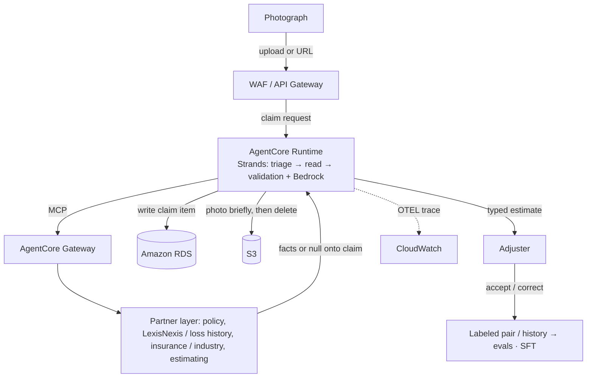
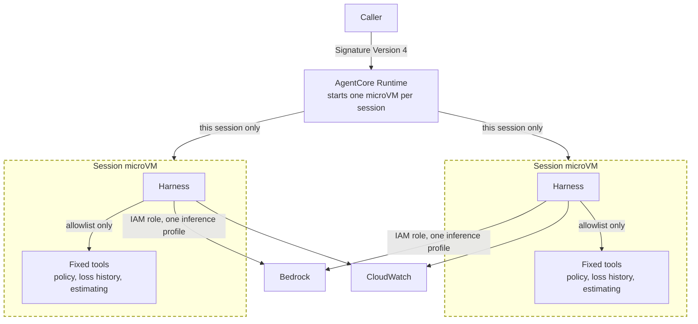

# Claims factory

## Business problem

Today most auto physical-damage claims still lean on manual triage and field or desk appraisal: slow handoffs, uneven estimates, and leakage when severity is understated or parts are missed. Industry averages put FNOL-to-vehicle-return near three weeks (J.D. Power: about 22–23 days recently), with appraisal alone often adding several days and tens to low hundreds of dollars per inspection. A photograph is a thin signal: occlusion, lighting, prior damage, and multi-vehicle frames make a reliable repair range hard to extract from photos alone. The desk still needs third-party facts the image cannot supply (policy, loss history, parts and labor guides), but those systems are fragmented and rarely wired into one typed claim.

## What this does

[The requirements](requirements.md): One photograph comes in; a typed claim record comes out. 

An agentic process turns one photograph of a damaged vehicle into a structured estimate the adjuster can review. When the photograph cannot support a price, the agent does not invent one.

**Input.** One photograph of a damaged vehicle, by file upload or by URL. JPEG, PNG, and WebP are accepted. A private URL, any other media type, or a file past the size limit is refused before a model is called.

**Output.** One JSON object. Make, model, and colour may each be null when the photograph does not support them. The damage summary is one description, of the form "left rear bumper dent with scratching," together with the parts and a coarse severity. The estimated repair cost is a rough range: a low and a high in whole dollars, a currency, the assumptions the range rests on, and a confidence. Status is `ok` only when both the summary and the range are present. `not_a_vehicle` and `unreadable` are complete answers and carry a null estimate. A plate that could be read is stored on the claim and removed from logs.

## Architecture

A harness is the loop around  agent(s) with prompts, tools, and stop. A factory runs that harness the same way on every claim, optimizing the loop for the quality of the estimate. Quality is one loop: update the harness from past claims history before production, score accuracy on realtime claims, and collect live labels for scheduled retrain.

The architecture holds three planes: **Control Plane**, **Execution Plane**, and **Data Plane**. Outside those bands: the adjuster (human), observability (OpenTelemetry out to CloudWatch), and a partner integration layer reached only through the MCP gateway.

**Control Plane** governs who may call and where traffic may go. Callers authenticate before a claim starts; credentials for the run stay off the claim. The photograph hits the public front door first — wrong type, oversized body, or private URL never reaches the agent. The runtime has no public address; model, storage, and telemetry stay on private paths. Plate values are stripped before any log or span.

**Execution Plane** runs one claim to a typed estimate. One AgentCore Runtime microVM wraps Strands and the vision model: triage, read, then validation against partner facts. When the photo cannot support a price, triage writes `not_a_vehicle` or `unreadable` with a null estimate. The typed record leaves to the adjuster outside the planes, who accepts or corrects; that pair joins claim history for evals.

**Data Plane** holds the claim record and reaches partners for facts the photograph cannot supply. Claim items and closed history persist; the photograph is brief, then deleted unless copied onto a labeled pair. MCP through AgentCore Gateway fetches provider facts with authn and authz on every call; a null from a provider stays null. Kept labels feed eval scores and training pairs; a newer model ships only after the held-out check.

### Claim data flow

The submitter sends one photograph of the damaged vehicle — upload or URL. The photograph enters through WAF and API Gateway into one AgentCore Runtime, where Strands runs triage, read, and validation against Bedrock and fetches partner facts over MCP through AgentCore Gateway. Control Plane admits the request; Execution Plane turns it into a typed estimate: identity, damage summary, and a rough low/high when the frame can support a price. Data Plane holds the claim and reaches partners for facts the photograph cannot supply. The claim lands in Amazon RDS, the photo is removed from S3 after the run. 

The adjuster reviews that record outside the planes, accepts or corrects it, and the kept pair joins claim history. When the photograph cannot support a price, the estimate stays null — nothing invented for the desk.

### Assumptions

1. Policy, coverage, and deductible are not in the photograph; the vehicle named on the notice is the compare key for mismatch.
2. Repair-price truth is the estimate the adjuster kept (and shop outcomes when present), not the model alone; the agent output is a visual low/high range.
3. Up to three years of closed claim history are available for offline evals and SFT pairs.
4. Hybrid, on-prem, and partner sources are reached via MCP through AgentCore Gateway, with authn and authz on every call.
5. The adjuster still accepts or corrects every estimate; desk authority limits may be unknown to the factory.
6. Photo bytes are deleted after the run unless copied onto a labeled pair for the eval or training set.

### Edge cases

Unusual inputs and operational boundaries. When the photograph or partner facts cannot support a price, the estimate stays null.

1. **Wrong vehicle in frame.** Plate or make/model disagrees with the vehicle named on the notice, or the frame shows a different car via glass, reflection, or a neighboring vehicle on a lot. Notice mismatch withholds the range.
2. **Multi-vehicle frame.** Two or more cars overlap or share the frame; which vehicle is the subject is ambiguous.
3. **Ambiguous or out-of-frame damage.** Claimed damage is outside the photograph, partially occluded, or prior repair that can read as new loss; part, location, or severity cannot be resolved from one frame.
4. **Low light or poor capture.** Lighting, blur, or angle limits identity or damage read — partial nulls rather than a forced range.
5. **Partner timeout or null.** A Data Plane MCP call times out or returns null; null stays on the claim — no invented fill.

## Security and reliability

Callers authenticate with AWS Signature Version 4 (SigV4) on each request, so the harness does not depend on Cognito and does not keep long-lived tokens in the repository. AgentCore Runtime executes the harness inside a microVM, which isolates each session from other sessions and from the host, and the deployed artifact is a code zip rather than a shared container that an operator has to run and patch. The runtime Identity and Access Management (IAM) role is scoped to a single Bedrock inference profile, the one named in `deploy.py` (currently `us.anthropic.claude-sonnet-4-6`), so the process cannot call an arbitrary model.

Signature Version 4 authenticates the caller. AgentCore Runtime then places that session in its own microVM. The dotted box is that isolation boundary, and inside it the harness may call only the named partner tools.

The harness does not store photographs. When a caller passes an image URL, the public-address check in `claims/images.py` refuses addresses that are not public, which keeps the runtime from fetching private or internal hosts. Adjuster review remains outside this path: the software returns a typed estimate for a person to accept or correct, and it does not authorize payment.

Reliability follows from a single fixed sequence — prompt, then tools, then stop — instead of open tool routing that could wander. A partner tool that returns null leaves that null on the claim rather than filling in a guessed fact. What the platform records today is CloudWatch traces and logs from the runtime; the application itself does not yet emit its own OpenTelemetry span tree.

## Evaluation

Quality is judged against what the adjuster kept on the same claim: photograph in; make, model, colour, damage summary, and rough range out. The label is accept or correct. Up to three years of closed history supply the offline slice; live accept/correct supply the realtime slice.

### Working

Four dimensions, each with a concrete measure against the adjuster's kept fields.

| Dimension     | What matters                                                                | What is measured                                                                              |
| ------------- | --------------------------------------------------------------------------- | --------------------------------------------------------------------------------------------- |
| Identity      | Make, model, and colour match the notice vehicle and what the adjuster kept | Field-level match rate (make / model / colour), null when the photo cannot support a value    |
| Damage        | Part and location agree with the adjuster's damage note                     | Part/location agreement vs adjuster summary; severity treated as secondary                    |
| Range         | Kept estimate falls inside the agent's low/high                             | In-range rate: adjuster's kept dollars ⊆ [low, high]                                          |
| Null estimate | Withholding the range when the photo cannot support a price                 | Correct null on `not_a_vehicle` / `unreadable` / unsupported damage; false ok = priced anyway |

### Failure

Failures ranked by cost to the carrier — not by how often they appear:

1. **Bad range that looks usable.** The agent returns a low/high the desk trusts, but the adjuster's kept dollars fall outside that band. Forces rework and erodes trust in every later estimate.
2. **Wrong make (often wrong model).** The claim is framed on the wrong vehicle; damage and range follow that error.
3. **False ok.** Status is `ok` with a price when the photo should have been `not_a_vehicle` or `unreadable` and the estimate null. Confident nonsense is worse than a withheld range.

### Customer inputs

Required from the carrier to evaluate properly:

- **Data.** Up to three years of closed claim history: photograph (or retained labeled copy), vehicle named on the notice, adjuster labels (make, model, colour, damage), and the estimate the adjuster kept.
- **Subject-matter expert access.** An SME to adjudicate damage disagreements when agent output and adjuster notes diverge on part or location.
- **Historical baselines.** Desk or legacy estimator baseline on the same held-out slice, if available, so in-range and identity rates have a carrier-specific floor.
- **Label channel.** A path for live accept/correct so realtime scores use the same definition of "kept" as the offline corpus.

### Repair cost

An estimate is good enough when the agent's low–high range contains the dollar amount the adjuster kept. That check runs on held-out claim history and on live accept/correct traffic. Promote a model or harness only when the share of in-range estimates rises versus the baseline, and false-ok (pricing when the range should have been withheld) does not rise with it.

When the estimate is wrong, the written record stays as produced; the adjuster corrects make, damage, or range; the accept/correct pair joins the training corpus. A null stays null until a human sets a kept value — no invented fill from estimating or from an edge rule.

### How evaluation runs

1. **Pre-prod.** SFT on labeled pairs from ≤3 years of history; offline gate on a held-out slice before the model or harness ships.
2. **Realtime.** Same four dimensions scored on live adjuster accept/correct as claims land (or on a rolling window). Continuous scoring, not mid-request weight updates.
3. **Live learning.** Append each labeled pair to the corpus; scheduled retrain of model and harness, still gated by held-out and recent realtime evals. Optional RLHF only when rewrite preference pairs exist.

## Tradeoffs

Each choice below gives something up:

1. **Fixed harness vs open tool-routing.** Evals and traces compare claim-to-claim, but a claim that needs an ad-hoc tool path the harness never encoded stalls or degrades instead of improvising.
2. **Bedrock vision alone vs a separate image-labeling stage.** One call can draft identity, damage, and range; variance and wrong-vehicle / wrong-part errors are higher than with a detector-first pipeline, so partner facts and adjuster keep carry more of the load.
3. **Partners only via MCP / AgentCore Gateway.** Authenticated, authorized, null-safe facts — at the cost of extra latency and hard dependency on partner uptime. A timeout leaves gaps on the claim; nothing is filled in.
4. **MicroVM per run vs a shared long-lived process.** Claim isolation is strong; unit cost and ops surface are higher once off localhost.
5. **One photograph vs multi-angle / inspection evidence.** Faster first notice; multi-panel or occluded loss often yields null or a wide band until more evidence arrives.
6. **Supervised fine-tune plus held-out gate vs continuous online learning.** Promote/rollback stays crisp and production weights stay stable; a new failure mode waits for the next gated retrain instead of adapting mid-stream.

